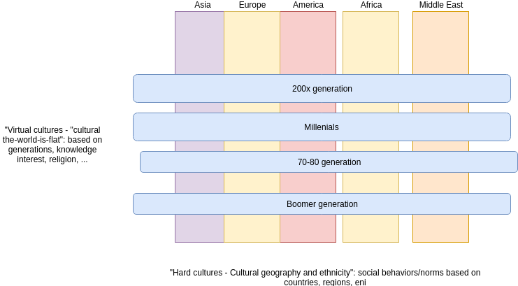

## "Hard cultures" and "Cultural The-World-is-Flat"
My thought of how to become "multicultural competence" is to have a perspective on what does it mean "multi-culture". I  have been living and working with many people from many backgrounds so I have some experiences. Through the discussion, it seems to me that we are still quite in the view of culture from the geography and ethnicity perspectives: the "hard culture" that most of us know and experience and pay a lot of attention: cultural geography and ethnicity with different social norms and behaviors.

I was thinking that we could try to abstract multicultures in a broad way. Thinking from a computer scientist perspective, I view multi cultures as "layers" and "hard"/"virtual", show in the below figure:

Of course it is just a simple view at the first sight: we need to understand cultures from cultural geography and ethnicity perspectives so that to understand how our students (defined as the ones that we teach) interact and behave in learning and researching. Clearly we will see students from Vietnam/China different from Germany/Austria. But we should not forget another very important perspective - I dont know how to call so I name - the "cultural the-world-is-flat", the behaviors and norms are established based on generation, knowledge, interest, religion, etc. The cultural the-world-is-flat has a very different type of interactions, e.g., some expect to talk but other expect to whatapps.  If we look at people we teach, we might wonder who are they in the figure and might figure out the best way to interact with them. We can also  figure out what they already know and can concentrate on what they need for learning? E.g., children use Microsoft Teams for remote learning during COVID-19 so it would be "strange" if I use "email" to communicate with their generation in my teaching, say, 6 years from now.

Of course thinking cultures from the above-mentioned figure is still simple because at the end, we have a multi-dimensional view on culture and "hard cultures" and "virtual cultures" are a kind of complex networks. However, it could be a starting point for us to think what kind of competence to build to deal with the vertical and horizontal layers of cultures? Where are our weakness in understanding multicultures would be the first point to address?
